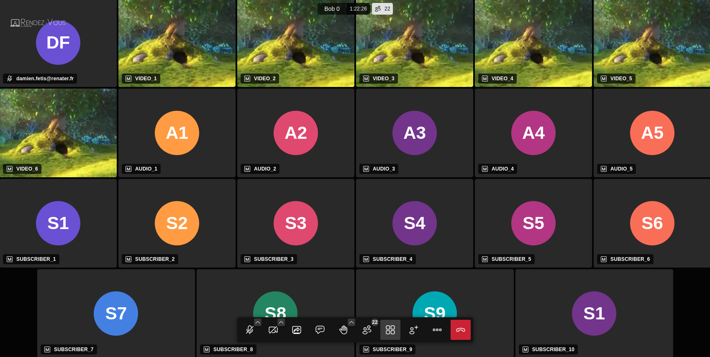

# jitsi-load-test-cli

A simple bash-based CLI tool for performing load tests on a Jitsi-Meet instance with customizable parameters.
This tool uses a dockerized version of [Gst-Meet](https://github.com/avstack/gst-meet) to simulate participants.
 
By default the media used for the video publising is sored in media folder and it's a small vp8 Big Buck Bunny.

## Features

- Specify room and instance for the load test
- Configure the number of video and audio publishers
- Set the number of subscribers
- Define the duration of the load test
- Define the media file to use
- Define the lastN value

## Known limitations

- Your target Jitsi infrastructure must use XMPP over WebSocket for Jingle signaling.
- Your target Jitsi infrastructure must have Colibri over WebSocket enabled, as Gst-Meet does not yet support SCTP for Colibri traffic.
- You must use already encoded media file (vp8,vp9 or av1).

## Gst-Meet docker image

As no offical image of Gst-Meet is provided today you can build your own from the offical Gst-Meet repos or you can use my own daimoc/gst-meet.

By default the script use the [daimoc/gst-meet](https://hub.docker.com/r/daimoc/gst-meet) image .


## Requirements

- Bash (Unix shell)
- Docker

## Installation

1. Clone the repository:
    ```sh
    git clone https://github.com/daimoc/load-test-cli-tool.git
    ```
2. Navigate to the repository directory:
    ```sh
    cd load-test-cli-tool
    ```
3. Make the script executable:
    ```sh
    chmod +x load_test.sh
    ```
4. Install docker
   ```sh
   apt install docker.io
   ```

## Usage

Run the script with the required options:

```sh
./jitsi-load-test-cli.sh --room ROOM_NAME --instance INSTANCE_ID --video-publishers NUM_VIDEO_PUBLISHERS --audio-publishers NUM_AUDIO_PUBLISHERS --subscribers NUM_SUBSCRIBERS --duration DURATION_SECONDS
```

### Example

```sh
./jitsi-load-test-cli.sh --room "bob0" --instance "Instance1" --video-publishers 6 --audio-publishers 5 --subscribers 10 --duration 60 --token XXXXXXX
```

Result view from a browser user : 



### Options

- `--room` - Name of the room
- `--instance` - Instance identifier
- `--video-publishers` - Number of video publishers
- `--audio-publishers` - Number of audio publishers
- `--subscribers` - Number of subscribers
- `--duration` - Duration of the test in seconds
- `--media` - Media file to use for publisher (it shoud be in webm format)
- `--media` - Name of the video file stored in media folder used for traffic generation"
- `--video-codec` - Video codec used by video sender agents. It must match your media file becaus we don't want codec transcription in a load testing tool (default to vp8)"
- `--token` - JWT token to run test on Jitsi-Meet with authentification enable"
- `--last-n` - Last-N value setting for subscribers to limit received video streams per subscribers (default to 25)"
- `--room-numbers` - Number of rooms created for the test. Each room is named $room_$index and will have configured the same video-publishers, audio-publishers and  subscribers. By default only one room is created with name = $room"
  

### JWT Token Warning

If you want to run your test with a Jitsi-Meet instaltion with JWT authentification enabaled you need to provide a valid token to the test-cli script. And if you need to use multiple room generation option (--room-numbers), you need to provide a token valid for all the rooms (room:* in the token payload).

### Media files


Currently, I don't know if simulcast is possible at the sender part of Gst-Meet. It is still under discussion in the Gst-Meet repository: [here](https://github.com/avstack/gst-meet/issues/22#issuecomment-2188876696).

So, I ran tests with three different media qualities to match WebRTC simulcast used by default Jitsi :
- High: 1280x720,VP8 , Target Bitrate 1.5 Mb/s
- Standard: 640x360,VP8 , Target Bitrate 500 kb/s
- Low: 320x180,VP8 , Target Bitrate 200 kb/s


You can generate your test files with FFmpeg from your favorite source video (Big Buck Bunny, Narwhals...):

```sh
ffmpeg -i INPUT_FILE -r 30 -s 1280x720 -c:v libvpx -quality realtime -keyint_min 120  -minrate 1.5M -maxrate 1.5M -b:v 1.5M -c:a libopus -ac 2 result_high.webm 

ffmpeg -i INPUT_FILE -r 30 -s 640x360 -c:v libvpx -quality realtime -keyint_min 120  -minrate 500k -maxrate 500k -b:v 500k -c:a libopus -ac 2 result_standard.webm 

ffmpeg -i INPUT_FILE -r 30 -s 320x180 -c:v libvpx -quality realtime -keyint_min 120  -minrate 200k -maxrate 2M -b:v 200k -c:a libopus -ac 2 result_low.webm 
```
The default file is bbb.webm, which is a Big Buck Bunny VP8 284x160 200 Kbit and Opus 48000 96 Kbits.


### Contributing

Contributions are welcome! Please open an issue or submit a pull request for any changes or improvements.

### License

This project is licensed under the Apache-2.0 License - see the [LICENSE](LICENSE) file for details.

### Author

- Damien Fetis [daimoc](https://github.com/daimoc)

### Acknowledgments

- Inspiration : this tools is inpired by the LiveKit CLI tool
